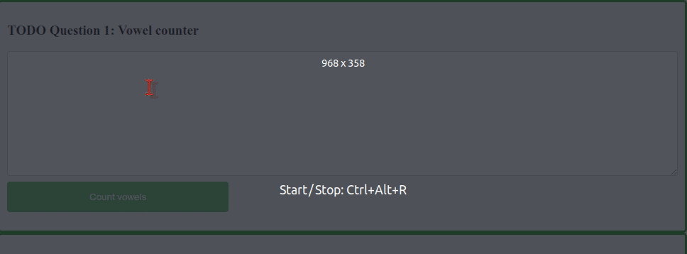

<div align="center">
  

# School of Electronic Engineering and Computer  Science

## ECS521U - INTERACTIVE MEDIA DESIGN AND PRODUCTION</br>Lab 4
</div>

### About this Lab
The purpose of this lab session is basis of data persistance.

Make sure to disable the browser cache to avoid issues with caching the JavaScript and CSS files. (e.g. In Google Chrome, open the development tools using  `Ctrl + Shift + i`, then click settings and tick "Disable cache (while DevTools is open)").


## A. Setup
1. Open `html/index.html` file in browser (chrome/firefox/ie).
2. Open `html/index.html` files in a text editor.

## B. Text Processing
Write a program to count the vowels in a text.

1. Open `js/process_text.js` file in a text editor
2. Add both the button and textarea elements:
   ```js
   let btn = document.getElementById('count_btn');
   let txt_field = document.getElementById('input_txt');
	```
3. Go to the onlick event definition for the button.
   ```js
   btn.onclick = function() {

   };
	```
4. Add the value typed on the text area.
   ```js
   let txt = txt_field.value;
   ```
5. Create an array that contains the vowels. This will be used later to check if a character in the text is a vowel.
   ```js
   const vowels = ['a', 'e', 'i', 'o', 'u'];
   ```
6. Traverse the input text and check if each character is a vowel or not. If it is, increase the counter by one.
   ```js
   let count = 0;

   for (let i = 0; i < txt.length; i++) {
	   if (vowels.includes(txt.charAt(i).toLowerCase())) {
           count++;
       }
   }
   ```
7. Get the element where the result is going to be displayed.
   ```js
   let result = document.getElementById('display_result');
   ```
8. Set a new value to the previous element, reflecting the number of vowels present in the input text.
   ```js
   result.innerHTML = 'Your input contains ' + count + ' vowels';
   // or
   result.innerHTML = `Your input contains ${count} vowels`;
   ```
9. Go back to your web browser, type some text in the text area and hit the "Count vowels" button.

## C. HTML5 Web Storage
1. HTML web storage; better than cookies.
2. With web storage, web applications can store data locally within the user's browser.
3. Before HTML5, application data had to be stored in cookies, included in every server request. Web storage is more secure, and large amounts of data can be stored locally, without affecting website performance.
4. Unlike cookies, the storage limit is far larger (at least 5MB) and information is never transferred to the server.
5. Web storage is per origin (per domain and protocol). All pages, from one origin, can store and access the same data.
6. HTML web storage provides two objects for storing data on the client:
   * `window.localStorage` - stores data with no expiration date
   * `window.sessionStorage` - stores data for one session (data is lost when the browser tab is closed)

   Before using web storage, check browser support for localStorage and sessionStorage:
   ```js
   if (typeof(Storage) !== "undefined") {
       // Code for localStorage/sessionStorage.
   } else {
       // Sorry! No Web Storage support..
   }
   ```
### The localStorage Object
The localStorage object stores the data with no expiration date. The data will not be deleted when the browser is closed, and will be available the next day, week, or year.
1. Open `html/last_name.html` in browser (chrome/firefox/ie).
2. Open `html/last_name.html` in text editor.
3. Add following statement for storing last name.
   ```js
   localStorage.setItem("lastname", "Wayne");
   ```
4. Add following statement to retrieve last name. <br/>
   ``` js
   document.getElementById("result").innerHTML = localStorage.getItem("lastname");
   ```
5. Reload `html/last_name.html` in your web browser.

### Comparing localStorage Object and sessionStorage Object
The sessionStorage object is equal to the localStorage object, except that it stores the data for only one session. The data is deleted when the user closes the specific browser tab.

1. Open `html/local_vs_session.html` in browser (chrome/firefox/ie).
2. Open `js/local_vs_session.js` in text editor.
3. Add following function for localStorage. Close and Open tab/window multiple times, while clicking the button, and notice counter value.

   ```js
   function clickCounter() {
       if (typeof(Storage) !== "undefined") {
           if (localStorage.clickcount) {
               localStorage.clickcount = Number(localStorage.clickcount)+1;
           } else {
               localStorage.clickcount = 1;
           }
           document.getElementById("result").innerHTML = `You have clicked the button  ${localStorage.clickcount}  time(s).`;
       } else {
           document.getElementById("result").innerHTML = "Sorry, your browser does not support web storage...";
       }
   }
   ```

4. Comment the code for localStorage and add following lines for sessionStorage. Close and Open tab/window multiple times, while clicking the button, and notice counter value.
   ```js
   function clickCounter() {
       if (typeof(Storage) !== "undefined") {
           if (sessionStorage.clickcount) {
               sessionStorage.clickcount = Number(sessionStorage.clickcount)+1;
           } else {
               sessionStorage.clickcount = 1;
           }
           document.getElementById("result").innerHTML = `You have clicked the button  ${sessionStorage.clickcount} time(s) in this session.`;
       } else {
           document.getElementById("result").innerHTML = "Sorry, your browser does not support web storage...";
       }
   }
   ```

## D. To Do Questions
**IMPORTANT NOTE**: Write your answers only in the sections indicated by the comment lines. Also, make sure that each answer works independently from the others. Verify this by commenting and uncommenting your answers to see if they still work. Not doing this will make you lose points.

Open `html/todo.html` and `js/todo.js` in your web browser and text editor, respectively.

1. Following the first exercise, given an input text, count the occurrences of each vowel independently. So you show something like this: `Your input contains a:6, e:1, i:2, o:3, u:2`. Make sure to apply the concept of [JS Objects](https://www.w3schools.com/js/js_objects.asp) to handle the counter per vowel and employ [JSON.stringify()](https://www.w3schools.com/js/js_json_stringify.asp) to print the counter easily.

   

2. Type your first name, last name and age and save them in the localStorage by clicking the `Save & display` button. Subsequently, remove the last name from localStorage and display the change using the `Remove last name` button. Now, clear the localStorage and display the changes using the `Clear local storage` button. **Hints.** [removeitem](https://www.w3schools.com/jsref/met_storage_removeitem.asp), [clear](https://www.w3schools.com/JSREF/met_storage_clear.asp), and [replace](https://developer.mozilla.org/en-US/docs/Web/JavaScript/Reference/Global_Objects/String/replace). __All the special details are shown in the animation below__:

   

3. Follow the instructions from Q2 but now with the following changes:
* Employ `sessionStorage`.
* Use the `Remove first name` button to remove your first name from the storage and from the HTML form.


## Submission Instructions:
### Deadline: 28/10/22 17:00
The Submission Link is available under ASSESMENT INFORMATION/RESOURCES Section of Module Page.
### General Instruction:
- Assignments must be submitted in a .zip package or alike ( .7z .bdoc .cdoc .ddoc .gtar .tgz .gz .gzip .hqx .rar .sit .tar .zip). Code submitted in other formats will not be accepted. Corrupt or otherwise unreadable files will not be accepted.
- Make sure to compress/zip the whole folder `ECS521-Interactive-Media-Design-and-Production-Labs-Work-2022-Lab-4-main` so all your work is included in the submission.
- Rename the compressed/zipped folder using your full name e.g.: `Giussepi Lopez.zip`

### Submission Checklist
- [x] Has your file been saved in a zip package?
- [x] Have you clicked [Submit] after uploading?
- [x] Have you checked that the file you uploaded is the correct version?
- [x] The first time you submit, you will be required to accept the Turnitin End User Licence Agreement.
- [x] After uploading, it is your responsibility to check that your file is in the correct format and that it is readable.

Late submissions will receive late penalties in line with the late penalty policy, see EECS handbook and QMUL assessment handbook.

### Specific Instructions:
1. Each fully answered question gives you a third of the marks.

## Good Luck!
